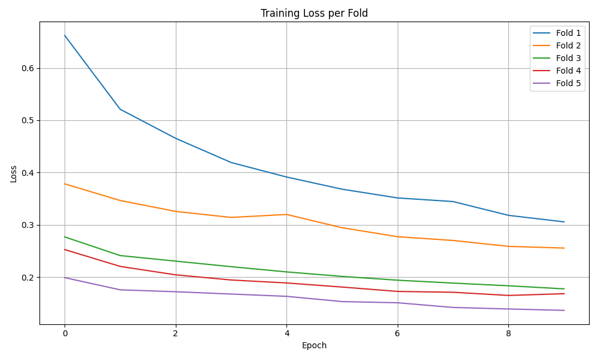
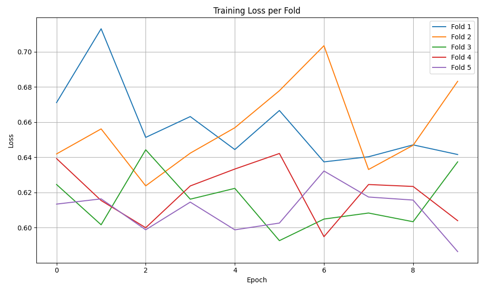
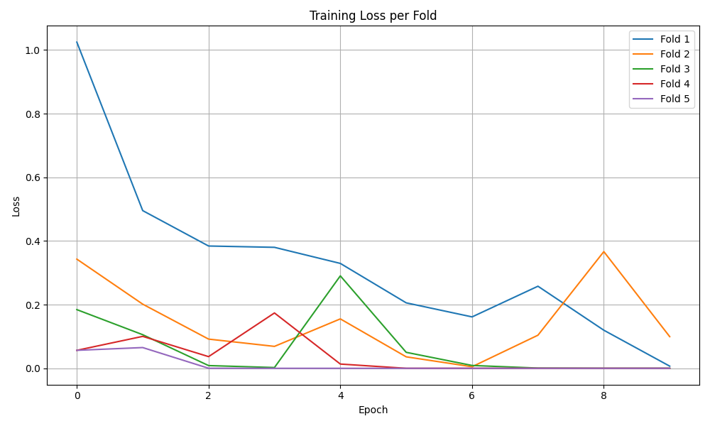

# Resultats
## Resultats Validació

| Arquitectura | AUC | Recall Benigne | Recall Maligne | Precision Benigne | Precision Maligne | F1-Score Benigne | F1-Score Maligne |
| --- | --- | --- | --- | --- | --- | --- | --- |
| ViT | 0.9343 ± 0.0523 | 0.8580 ± 0.0730 | 0.8716 ± 0.1031 | 0.6818 ± 0.1498 | 0.9572 ± 0.0222 | 0.7509 ± 0.1153 | 0.9089 ± 0.0685 |
| --- | --- | --- | --- | --- | --- | --- | --- |
| ViT Preentrenat 100 epochs | 0.7744 ± 0.0446 | 0.8872 ± 0.1489 | 0.5107 ± 0.1082 | 0.3335 ± 0.0488 | 0.9518 ± 0.0442 | 0.4784 ± 0.0611 | 0.6562 ± 0.0744 |
| --- | --- | --- | --- | --- | --- | --- | --- |
| ViT + GNN (Només matriu) | 0.6631 ± 0.0759 | 0.0186 ± 0.0228 | 0.9873 ± 0.0139 | 0.3000 ± 0.4000 | 0.7867 ± 0.0081 | 0.0348 ± 0.0427 | 0.8757 ± 0.0102 |
| --- | --- | --- | --- | --- | --- | --- | --- |
| ViT + GNN (Matriu + Features) 25 epochs| 0.9677 ± 0.0647 | 0.8091 ± 0.2594 | 0.9899 ± 0.0203 | 0.9273 ± 0.1455 | 0.9523 ± 0.0634 | 0.8546 ± 0.2203 | 0.9701 ± 0.0428 |
| --- | --- | --- | --- | --- | --- | --- | --- |
| ViT + CNN (Features + Arquitectura) 25 epochs | 0.9455 ± 0.0748 | 0.8890 ± 0.1324 | 0.8952 ± 0.1032 | 0.7375 ± 0.1905 | 0.9657 ± 0.0399 | 0.7991 ± 0.1627 | 0.9265 ± 0.0739 |
| --- | --- | --- | --- | --- | --- | --- | --- |
| ViT + CNN (Features + Linear) 25 epochs | 0.9077 ± 0.0870 | 0.8207 ± 0.1815 | 0.8487 ± 0.0627 | 0.6022 ± 0.1277 | 0.9456 ± 0.0530 | 0.6913 ± 0.1459 | 0.8936 ± 0.0527 |

## Resultats Holdout
| Arquitectura | AUC | Recall Benigne | Recall Maligne | Precision Benigne | Precision Maligne | F1-Score Benigne | F1-Score Maligne |
| --- | --- | --- | --- | --- | --- | --- | --- |
| ViT | 0.2800 | 0.0400 | 0.8333 | 0.3333 | 0.2941 | 0.0714 | 0.4348 |
| --- | --- | --- | --- | --- | --- | --- | --- |
| ViT Preentrenat | 0.3231 | 0.4000 | 0.4615 | 0.5882 | 0.2857 | 0.4762 | 0.3529 |
| --- | --- | --- | --- | --- | --- | --- | --- |
| ViT + GNN (Només matriu) | 0.1567 | 0.0000 | 1.0000 | 0.0000 | 0.3243 | 0.0000 | 0.4898 |
| --- | --- | --- | --- | --- | --- | --- | --- |
| ViT + GNN (Matriu + Features)| 0.4554 | 0.0400 | 0.8462 | 0.3333 | 0.3143 | 0.0714 | 0.4583 |
| --- | --- | --- | --- | --- | --- | --- | --- |
| ViT + CNN (Features + Arquitectura)| 0.3538 | 0.2400 | 0.9231 | 0.8571 | 0.3871 | 0.3750 | 0.5455 |
| --- | --- | --- | --- | --- | --- | --- | --- |
| ViT + CNN (Features + Linear)| 0.3377 | 0.1905 | 0.9091 | 0.8000 | 0.3704 | 0.3077 | 0.5263 |

# Gràfiques del Loss:

## ViT:

## ViT Preentrenat:

## Vit + GNN (Matriu + Features):

## ViT + CNN (Features + Linear):
.png)

## Vit + CNN (Features + Arquitectura):
.png)

## Vit + CNN (Features + Lineal):
.png)
