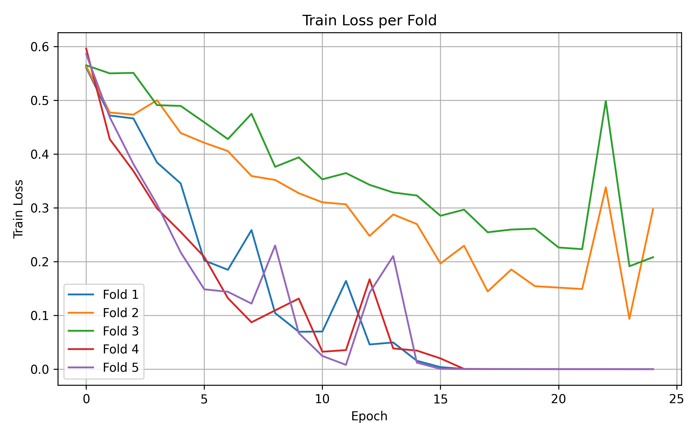
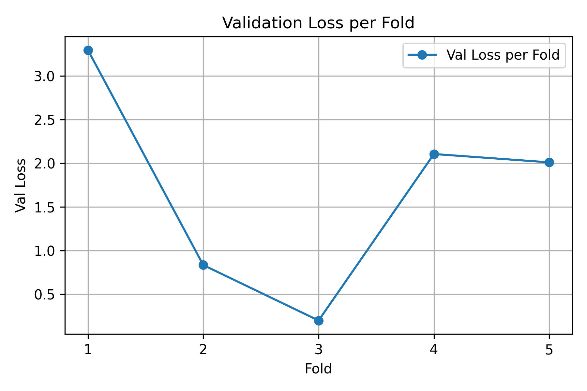
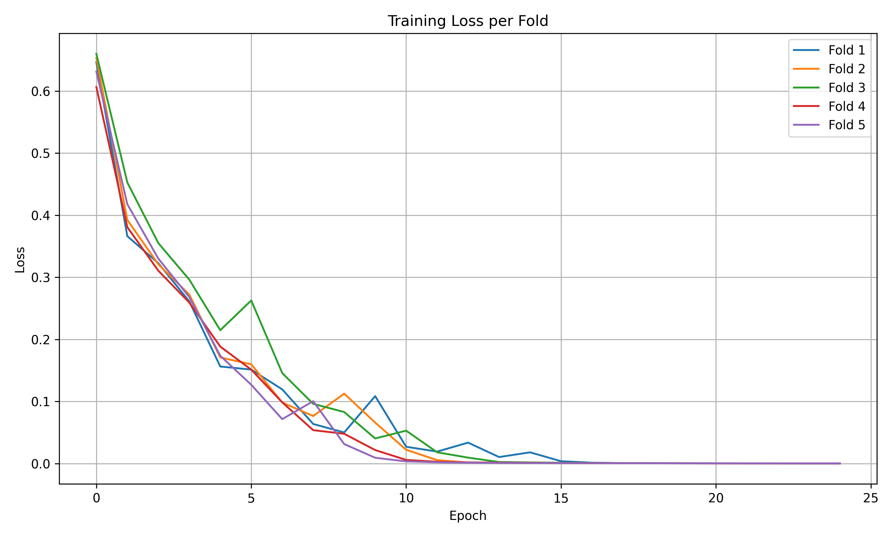
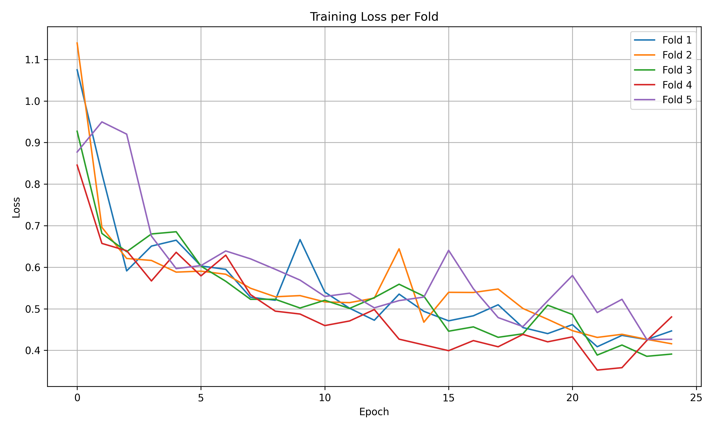
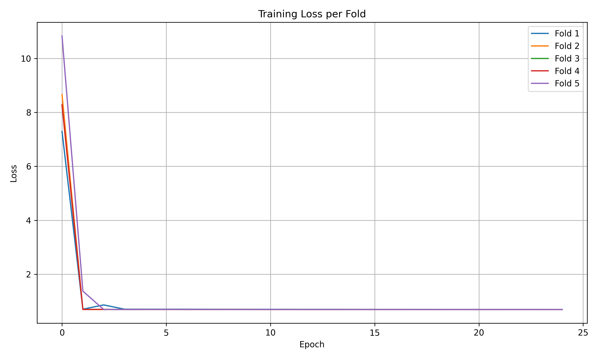
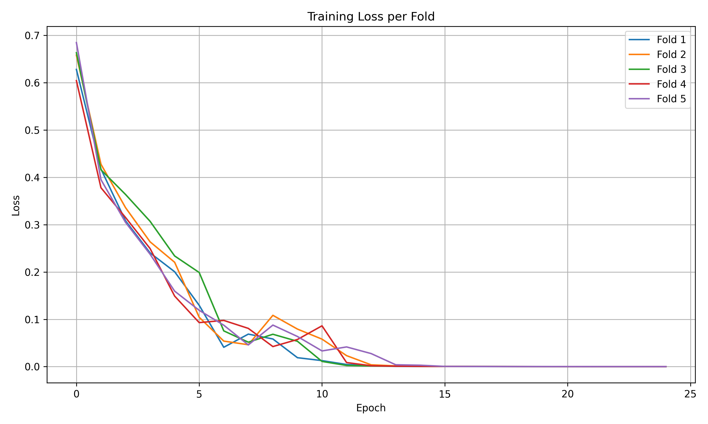
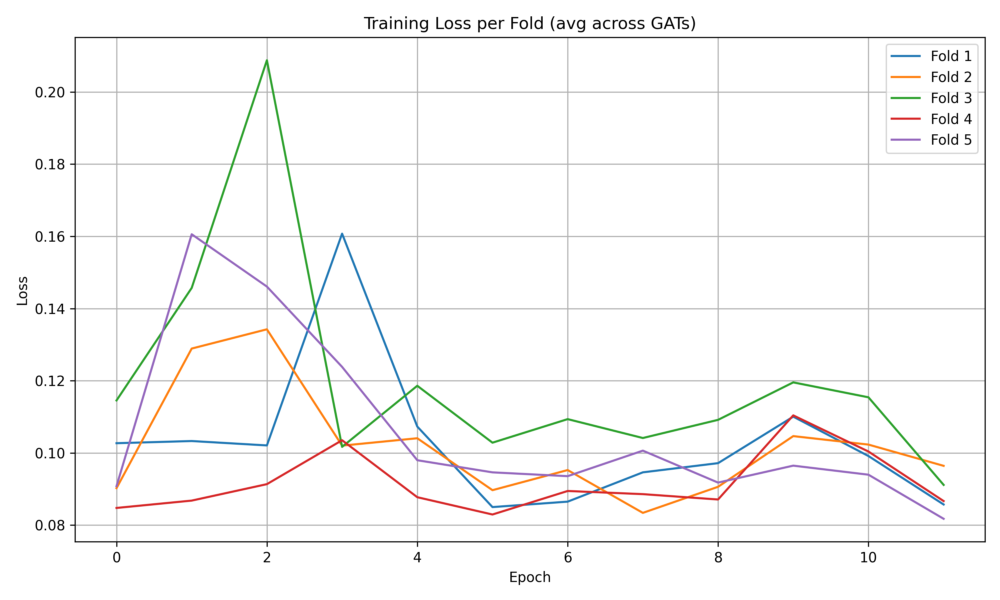
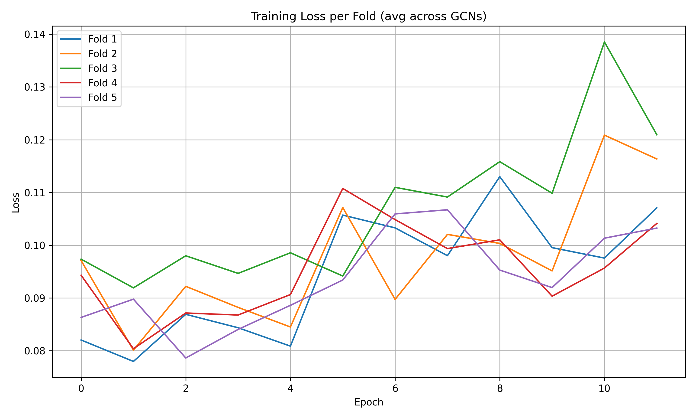
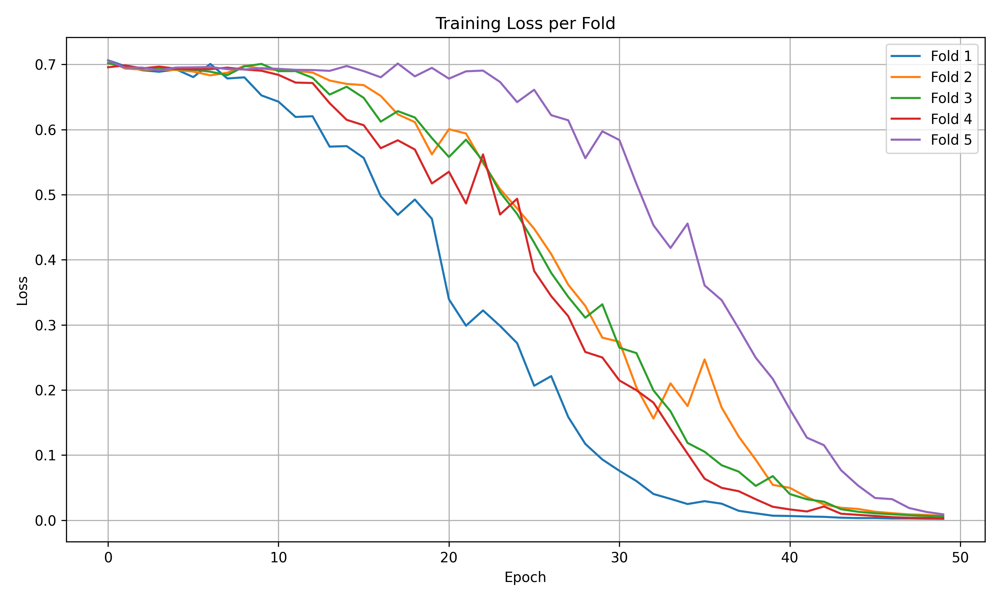
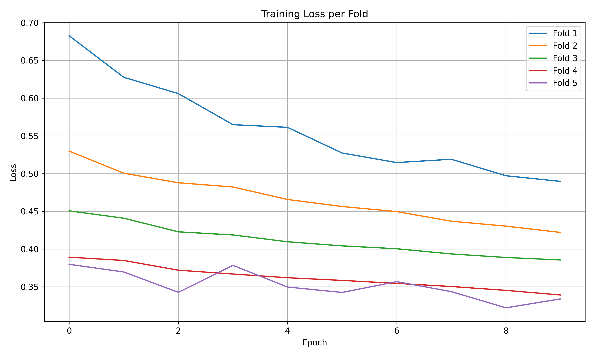

# Descripció fitxers:

A tots els entrenos que fan ús de Graph Neural Networks he fet servir features i edge attributes:

RocCurves: Imatges de totes les corbes ROC resultants d'entrenar els models.

Images: Graelles de loss de tots els entrenos que he anat fent

Attention_triplets: Triplets on es mostra la imatge original, on posa l’atenció el ViT i on posa l’atenció el GAT.

DenseNet.py (DenseNet 25 epochs): KFold i Holdout de una Densenet

EnsembleGAT.py (ViT + GAT (Ensemble) 25 epochs): Extreure les 12 matrius d’atenció del ViT, entrenar un GAT amb cada una d’aquestes matrius i fer MaxVoting en el Holdout.

EnsembleGCN.py (ViT + GCN (Ensemble) 25 epochs): Extreure les 12 matrius d’atenció del ViT, entrenar un GCN amb cada una d’aquestes matrius i fer MaxVoting en el Holdout.

GATAGG.py (ViT + GAT (Agregació) 25 epochs): Agafar les 12 matrius d’atenció del ViT, passar-les a una capa d’agregació i fer-les servir per entrenar el model GAT.

GCNAgg.py (ViT + GCN (Agregació) 25 epochs): Agafar les 12 matrius d’atenció del ViT, passar-les a una capa d’agregació i fer-les servir per entrenar el model GCN.

MatAdj+Features.py (ViT + GAT (Mitjana) 25 epochs): Agafar les 12 matrius d’atenció del ViT, fer-ne la mitjana i fer servir la matriu resultant de la mitjana per entrenar un model GAT.

ResNet.py (ResNet 25 epochs): KFold i Holdout de una Resnet.

ViT+CNN (Lineal).py (ViT + CNN (Linear) 25 epochs): Agafar el vector de característiques del ViT, fer-ne la mitjana i fer servir la matriu resultant de la mitjana per entrenar una capa Linear.

ViT+CNNArc.py (ViT + CNN (Arquitectura) 25 epochs): Agafar el vector de característiques del ViT, fer-ne la mitjana i fer servir la matriu resultant de la mitjana per entrenar la arquitectura CNN que em vas passar per mail.

ViT+GCN.py (ViT + GCN (Binarització) 25 epochs i ViT + GCN (No Binarització) 25 epochs): Agafar les 12 matrius d’atenció del ViT, fer-ne la mitjana i fer servir la matriu resultant de la mitjana per entrenar un model GCN.

ViTKFold.py (ViT 25 epochs): KFold i Holdout de un ViT tal cual el dona la llibreria.

ViTPreentrenat.py (ViT Preentrenat 25 epochs): KFold i Holdout de un ViT amb els pesos d’un ViT suposadament entrenat en histopatologia.

heatmaps.py: Procés de creació dels mapes de calor per visualitzar la atenció de cada model.

CNN.py (CNN 3 Conv2d 50 epochs): Entreno validació i holdout utilitzant una cnn amb 3 capes de convolució.

# Resultats
## Resultats Validació

| Arquitectura | AUC | Recall Benigne | Recall Maligne | Precision Benigne | Precision Maligne | F1-Score Benigne | F1-Score Maligne |
| --- | --- | --- | --- | --- | --- | --- | --- |
| ViT 25 epochs | 0.7780 ± 0.0426 | 0.5992 ± 0.1162 | 0.7913 ± 0.0577 | 0.4549 ± 0.0587 | 0.8824 ± 0.0364 | 0.5176 ± 0.0525 | 0.8325 ± 0.0338 |
| --- | --- | --- | --- | --- | --- | --- | --- |
| ViT Preentrenat 25 epochs | 0.6018 ± 0.0762 | 0.6531 ± 0.3104 | 0.5504 ± 0.2310 | 0.2544 ± 0.1135 | 0.8765 ± 0.0695 | 0.3600 ± 0.1595 | 0.6426 ± 0.1584 |
| --- | --- | --- | --- | --- | --- | --- | --- |
| ViT + GAT (Mitjana) 25 epochs | 0.7558 ± 0.1070 | 0.3850 ± 0.2367 | 0.8767 ± 0.0537 | 0.4480 ± 0.1726 | 0.8369 ± 0.0671 | 0.4057 ± 0.2046 | 0.8555 ± 0.0550 |
| --- | --- | --- | --- | --- | --- | --- | --- |
| ViT + CNN (Features + Arquitectura) 25 epochs | 0.6755 ± 0.0406 | 0.5537 ± 0.1315 | 0.7974 ± 0.1033 | 0.4529 ± 0.0737 | 0.8680 ± 0.0346 | 0.4846 ± 0.0530 | 0.8265 ± 0.0616 |
| --- | --- | --- | --- | --- | --- | --- | --- |
| ViT + CNN (Features + Linear) 25 epochs | 0.9077 ± 0.0870 | 0.8207 ± 0.1815 | 0.8487 ± 0.0627 | 0.6022 ± 0.1277 | 0.9456 ± 0.0530 | 0.6913 ± 0.1459 | 0.8936 ± 0.0527 |
| --- | --- | --- | --- | --- | --- | --- | --- |
| ViT + GCN (Mitjana No Binarització) 25 epochs | 0.7720 ± 0.0963 | 0.3347 ± 0.1133 | 0.9082 ± 0.0577 | 0.5536 ± 0.2662 | 0.8304 ± 0.0370 | 0.4076 ± 0.1479 | 0.8669 ± 0.0405 |
| --- | --- | --- | --- | --- | --- | --- | --- |
| ViT + GCN (Mitjana Binarització) 25 epochs | 0.7442 ± 0.1025 | 0.3134 ± 0.1263 | 0.9045 ± 0.0659 | 0.5353 ± 0.2922 | 0.8245 ± 0.0451 | 0.3848 ± 0.1686 | 0.8618 ± 0.0478 |
| --- | --- | --- | --- | --- | --- | --- | --- |
| Arquitectura | AUC | Recall Benigne | Recall Maligne | Precision Benigne | Precision Maligne | F1-Score Benigne | F1-Score Maligne |
| --- | --- | --- | --- | --- | --- | --- | --- |
| ResNet 25 epochs | 0.7029 ± 0.0818 | 0.4671 ± 0.2493 | 0.8014 ± 0.0974 | 0.4106 ± 0.0770 | 0.8526 ± 0.0439 | 0.3959 ± 0.1503 | 0.8216 ± 0.0425 |
| --- | --- | --- | --- | --- | --- | --- | --- |
| DenseNet 25 epochs | 0.5000 ± 0.0000 | 0.6000 ± 0.4899 | 0.4000 ± 0.4899 | 0.1267 ± 0.1047 | 0.3096 ± 0.3798 | 0.2090 ± 0.1719 | 0.3488 ± 0.4275 |
| --- | --- | --- | --- | --- | --- | --- | --- |
| ViT + GCN (Agregació) 25 epochs | 0.7616 ± 0.0739 | 0.3173 ± 0.1043 | 0.9059 ± 0.0608 | 0.5458 ± 0.2386 | 0.8259 ± 0.0408 | 0.3777 ± 0.0925 | 0.8623 ± 0.0330 |
| --- | --- | --- | --- | --- | --- | --- | --- |
| ViT + GAT (Agregació) 20 epochs | 0.7213 ± 0.0916 | 0.3320 ± 0.0843 | 0.8869 ± 0.0741 | 0.5018 ± 0.1872 | 0.8250 ± 0.0421 | 0.3847 ± 0.1009 | 0.8535 ± 0.0482 |
| --- | --- | --- | --- | --- | --- | --- | --- |
| ViT + GAT (Ensenmble) 25 epochs | 0.7488 ± 0.0972 | 0.2718 ± 0.1141 | 0.9350 ± 0.0413 | 0.5615 ± 0.2447 | 0.8207 ± 0.0450 | 0.3585 ± 0.1476 | 0.8735 ± 0.0372 |
| --- | --- | --- | --- | --- | --- | --- | --- |
| ViT + GCN (Ensemble) 25 epochs | 0.7495 ± 0.0994 | 0.3011 ± 0.1220 | 0.9145 ± 0.0533 | 0.5308 ± 0.2650 | 0.8241 ± 0.0405 | 0.3777 ± 0.1634 | 0.8663 ± 0.0402 |
| --- | --- | --- | --- | --- | --- | --- | --- |
| CNN 3 Conv2d 50 epochs | 0.5727 ± 0.0573 | 0.3140 ± 0.1023 | 0.7489 ± 0.0409 | 0.2290 ± 0.0582 | 0.7915 ± 0.0424 | 0.2393 ± 0.0664 | 0.7481 ± 0.0184 |

## Resultats Holdout
| Arquitectura | AUC | Recall Benigne | Recall Maligne | Precision Benigne | Precision Maligne | F1-Score Benigne | F1-Score Maligne |
| --- | --- | --- | --- | --- | --- | --- | --- |
| ViT | 0.2033 | 0.0400 | 0.8333 | 0.3333 | 0.2941 | 0.0714 | 0.4348 |
| --- | --- | --- | --- | --- | --- | --- | --- |
| ViT Preentrenat | 0.2300 | 0.4400 | 0.0833 | 0.5000 | 0.0667 | 0.4681 | 0.0741 |
| --- | --- | --- | --- | --- | --- | --- | --- |
| ViT + GAT (Matriu + Features) | 0.4033 | 0.1600 | 0.8333 | 0.6667 | 0.3226 | 0.2581 | 0.4651 |
| --- | --- | --- | --- | --- | --- | --- | --- |
| ViT + CNN (Features + Arquitectura) | 0.3200 | 0.1200 | 0.9167 | 0.7500 | 0.3333 | 0.2069 | 0.4889 |
| --- | --- | --- | --- | --- | --- | --- | --- |
| ViT + CNN (Features + Linear) | 0.3377 | 0.1905 | 0.9091 | 0.8000 | 0.3704 | 0.3077 | 0.5263 |
| --- | --- | --- | --- | --- | --- | --- | --- |
| ViT + GCN (No Binarització) | 0.4050 | 0.0400 | 0.8333 | 0.3333 | 0.2941 | 0.0714 | 0.4348 |
| --- | --- | --- | --- | --- | --- | --- | --- |
| ViT + GCN (Binarització) | 0.4083 | 0.0400 | 0.9167 | 0.5000 | 0.3143 | 0.0741 | 0.4681 |
| --- | --- | --- | --- | --- | --- | --- | --- |
| Arquitectura | AUC | Recall Benigne | Recall Maligne | Precision Benigne | Precision Maligne | F1-Score Benigne | F1-Score Maligne |
| --- | --- | --- | --- | --- | --- | --- | --- |
| ResNet | 0.8967 | 0.5200 | 0.9167 | 0.9286 | 0.4783 | 0.6667 | 0.6286 |
| --- | --- | --- | --- | --- | --- | --- | --- |
| DenseNet | 0.5000 | 0.0000 | 1.0000 | 0.0000 | 0.3243 | 0.0000 | 0.4898 |
| --- | --- | --- | --- | --- | --- | --- | --- |
| ViT + GCN (Agregació) | 0.4100 | 0.0000 | 0.9167 | 0.0000 | 0.3056 | 0.0000 | 0.4583 |
| --- | --- | --- | --- | --- | --- | --- | --- |
| ViT + GAT (Agregació) | 0.3817 | 0.0000 | 0.9167 | 0.0000 | 0.3056 | 0.0000 | 0.4583 |
| --- | --- | --- | --- | --- | --- | --- | --- |
| ViT + GAT (Ensemble) | 0.4333 | 0.0000 | 0.9167 | 0.0000 | 0.3056 | 0.0000 | 0.4583 |
| --- | --- | --- | --- | --- | --- | --- | --- |
| ViT + GCN (Ensemble) | 0.4083 | 0.0800 | 0.8333 | 0.5000 | 0.3030 | 0.1379 | 0.4444 |
| --- | --- | --- | --- | --- | --- | --- | --- |
| CNN 3 Conv2d | 0.3767 | 0.2000 | 0.8333 | 0.7143 | 0.3333 | 0.3125 | 0.4762 |

# Gràfiques del Loss:

## ViT:

## ViT Preentrenat:

## Vit + GAT (TRAIN):

## Vit + GAT (VALIDACIO):

## Vit + CNN (Features + Arquitectura):

## Vit + GCN (NoBin):

## Vit + GCN (Bin):

## ResNet:

## DenseNet:

## Vit + GCN (Agg):

## Vit + GAT (Agg) (TRAIN):
.png)

## Vit + GAT (Agg) (VALIDACIO):
.png)

## Vit + GAT (Ensemble):

## Vit + GCN (Ensemble):

## CNN Conv2d:

## ViT+CNN (Linear):

